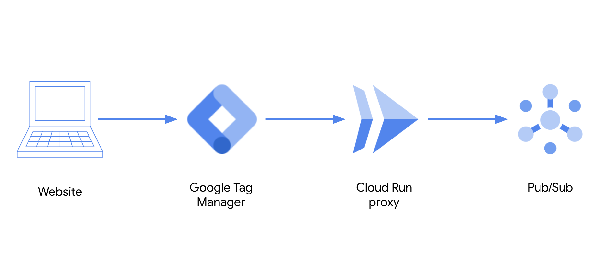

# Click stream data - Data Layer to Pub/Sub



This repo contains example code to show how to send data from a ecommerce website to Pub/Sub using Google Tag Manager, Cloud Run and Pub/Sub.

The data structure uses the [Data Layer Ecommerce](https://developers.google.com/tag-manager/ecommerce-ga4) format recommended for Google Tag Manager

## Git clone repo

```
git clone https://github.com/GoogleCloudPlatform/dataflow-sample-applications.git
cd dataflow-sample-applications/retail/clickstream
```

## Set-up Cloud Environment

### Initilize your account and project

```shell
gcloud init
```

### Enable Cloud Cloud APIs

```
gcloud services enable run.googleapis.com cloudbuild.googleapis.com pubsub.googleapis.com
```

### Set compute zone

```
gcloud config set compute/zone us-central1-f
```

### Set Google Cloud Project

```
export GOOGLE_CLOUD_PROJECT=my-project-id
```

## Create Pub/Sub Topic and Subscription

### Create Pub/Sub topic

```
gcloud pubsub topics create retail-clickstream
```

### Create Pub/Sub subscription

```
gcloud pubsub subscriptions create retail-clickstream-sub --topic=retail-clickstream
```

## Create a Cloud Run proxy called datalayer-pubsub

As you can send data directly to Pub/Sub from a public facing website you will need to create a Cloud Run proxy which will be deployed as tag on your website using Google Tag Manager.

Modify the file `cloud-run/datalayer-pubsub/app.js` on line 26 to inclue the Pub/Sub topic name your created in the previous step


# Build container

```
export LOCAL_SOURCE_DIR=cloud-run/datalayer-pubsub

gcloud builds submit $LOCAL_SOURCE_DIR --tag gcr.io/$GOOGLE_CLOUD_PROJECT/datalayer-pubsub
```

If you receive permission error below give the service account access to GCS

```
ERROR: (gcloud.builds.submit) INVALID_ARGUMENT: could not resolve storage source: googleapi: Error 403: 12345678999@cloudbuild.gserviceaccount.com does not have storage.objects.get access to the Google Cloud Storage object., forbidden
```

### List containers

Check that the container was succesfully created

```
gcloud container images list
```

## Deploy container to Cloud Run

```
gcloud run deploy datalayer-pubsub \
  --image gcr.io/$GOOGLE_CLOUD_PROJECT/datalayer-pubsub \
  --platform managed \
  --region us-central1 \
  --allow-unauthenticated
```

You should see the following output that has your Cloud Run app's URL

```
Deploying container to Cloud Run service [datalayer-pubsub] in project [retail-data-demo] region [us-central1]
✓ Deploying... Done.
  ✓ Creating Revision...  
  ✓ Routing traffic...
  ✓ Setting IAM Policy... 
Done.
Service [datalayer-pubsub] revision [datalayer-pubsub-00002-kuw] has been deployed and is serving 100 percent of traffic at https://datalayer-pubsub-123abcd-uc.a.run.app
```

## Test the Cloud Run service

### Simulate sending website events to Cloud Run proxy using curl

```
curl -vX POST https://datalayer-pubsub-zzheer6emq-uc.a.run.app/proxy -d @datalayer/view_item.json \
--header "Content-Type: application/json"
```

```
curl -vX POST https://datalayer-pubsub-zzheer6emq-uc.a.run.app/proxy -d @datalayer/add_to_cart.json \
--header "Content-Type: application/json"
```

```
curl -vX POST https://datalayer-pubsub-zzheer6emq-uc.a.run.app/proxy -d @datalayer/purchase.json \
--header "Content-Type: application/json"
```

## Pull data from Pub/Sub subscription

You may need to run this multiple times to see the result.

```shell
gcloud pubsub subscriptions pull retail-clickstream-sub --auto-ack --limit=10
```

## Clean up

### Delete Container Image

```
gcloud container images delete gcr.io/$GOOGLE_CLOUD_PROJECT/datalayer-pubsub
```

### Delete Cloud Run service

```
gcloud run services delete datalayer-pubsub \
  --platform managed \
  --region us-central1
```