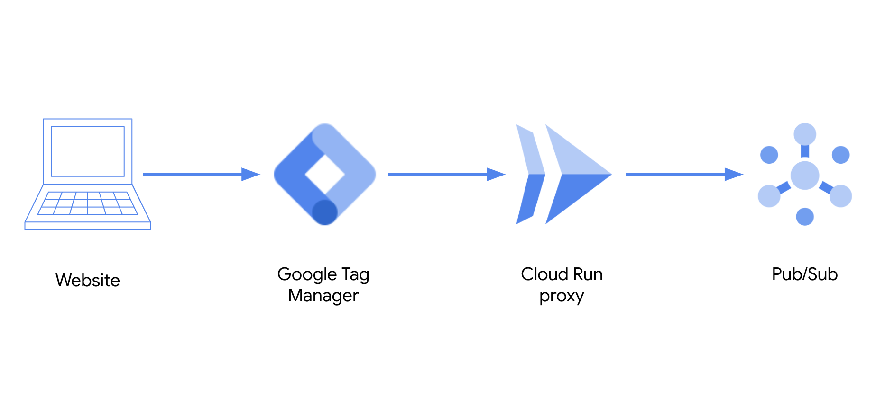

# Click stream data - Data Layer to Pub/Sub



This repo contains example code to show how to send data from a ecommerce website to Pub/Sub using Google Tag Manager, Cloud Run and Pub/Sub.

The data structure uses the [Data Layer Ecommerce](https://developers.google.com/tag-manager/ecommerce-ga4) format recommended for Google Tag Manager

## Git clone repo

```
git clone https://github.com/GoogleCloudPlatform/dataflow-sample-applications.git
cd dataflow-sample-applications/retail/retail-clickstream-application
```

## Set-up Cloud Environment

### Initilize your account and project

```shell
gcloud init
```

### Set Google Cloud Project

```
export GOOGLE_CLOUD_PROJECT=my-project-id
gcloud config set project $GOOGLE_CLOUD_PROJECT
```

### Enable Google Cloud APIs

```
gcloud services enable compute.googleapis.com cloudbuild.googleapis.com artifactregistry.googleapis.com
```

### Set compute zone

```
gcloud config set compute/zone us-central1-f
```

# Build container

```
export RUN_SOURCE_DIR=cloud-run-pubsub-proxy

gcloud builds submit $RUN_SOURCE_DIR --tag gcr.io/$GOOGLE_CLOUD_PROJECT/pubsub-proxy
```

### List containers

Check that the container was succesfully created

```
gcloud container images list
```

You should see the following output:

```
NAME
gcr.io/my-project-id/pubsub-proxy
Only listing images in gcr.io/my-project-id. Use --repository to list images in other repositories.
```


## Deploy using Terraform

Use Terraform to deploy the folllowing services defined in the `main.tf` file

- Cloud Run
- Pub/Sub
- Google Cloud Storage
- Dataflow
- BigQuery

### Install Terraform

Follow the instructions to [install the Terraform cli](https://learn.hashicorp.com/tutorials/terraform/install-cli?in=terraform/gcp-get-started)

### Update Project ID in terraform.tfvars

Rename terraform.tfvars.example file to terraform.tfvars and update the default project ID in terraform.tfvars file to match your project ID

```
sed "-i" "" "-e" 's/default-project-id/'"$GOOGLE_CLOUD_PROJECT"'/g' terraform.tfvars
```

### Initialize Terraform

```
terraform init
```

You should see the following output

```
Initializing the backend...

Initializing provider plugins...
- Checking for available provider plugins...
- Downloading plugin for provider "google" (hashicorp/google) 3.48.0...

Terraform has been successfully initialized!

You may now begin working with Terraform. Try running "terraform plan" to see
any changes that are required for your infrastructure. All Terraform commands
should now work.

If you ever set or change modules or backend configuration for Terraform,
rerun this command to reinitialize your working directory. If you forget, other
commands will detect it and remind you to do so if necessary.
```

### Create resoureces in Google Cloud

*Note: Since Terraform 0.12 and above you no longer need to run `terraform plan` first.*

```
terraform apply -var-file terraform.tfvars
```

This will show you a plan of everything that will be created and then the following notification where you should enter `yes` to proceed:

```
Plan: 17 to add, 0 to change, 0 to destroy.

Do you want to perform these actions?
  Terraform will perform the actions described above.
  Only 'yes' will be accepted to approve.

  Enter a value: 
```

### Terraform output

Once everything has succesfully run you should see the following output:

```
google_compute_network.vpc_network: Creating...
google_pubsub_topic.ps_topic: Creating...
google_service_account.data_pipeline_access: Creating...
google_project_service.run: Creating...
google_bigquery_dataset.bq_dataset: Creating...
google_storage_bucket.dataflow_gcs_bucket: Creating...
google_bigquery_dataset.bq_dataset: Creation complete after 1s [id=projects/retail-data-demo/datasets/retail_dataset]
google_bigquery_table.bq_table: Creating...
google_storage_bucket.dataflow_gcs_bucket: Creation complete after 1s [id=retail-data-demo-ecommerce-events]
google_service_account.data_pipeline_access: Creation complete after 2s [id=projects/retail-data-demo/serviceAccounts/retailpipeline@retail-data-demo.iam.gserviceaccount.com]
google_bigquery_table.bq_table: Creation complete after 2s [id=projects/retail-data-demo/datasets/retail_dataset/tables/ecommerce_events]
google_project_iam_member.dataflow_admin_role: Creating...
google_project_iam_member.dataflow_worker_role: Creating...
google_project_iam_member.bigquery_role: Creating...
google_pubsub_topic.ps_topic: Creation complete after 4s [id=projects/retail-data-demo/topics/ecommerce-events]
google_pubsub_subscription.ps_subscription: Creating...
google_project_service.run: Creation complete after 4s [id=retail-data-demo/run.googleapis.com]
google_cloud_run_service.pubsub_proxy: Creating...
google_pubsub_subscription.ps_subscription: Creation complete after 4s [id=projects/retail-data-demo/subscriptions/ecommerce-events-pull]
google_dataflow_job.dataflow_stream: Creating...
google_compute_network.vpc_network: Still creating... [10s elapsed]
google_dataflow_job.dataflow_stream: Creation complete after 4s [id=2020-11-19_06_54_47-10288703401036332425]
google_project_iam_member.bigquery_role: Creation complete after 9s [id=retail-data-demo/roles/bigquery.dataEditor/serviceaccount:retailpipeline@retail-data-demo.iam.gserviceaccount.com]
google_project_iam_member.dataflow_admin_role: Still creating... [10s elapsed]
google_project_iam_member.dataflow_worker_role: Still creating... [10s elapsed]
google_project_iam_member.dataflow_admin_role: Creation complete after 10s [id=retail-data-demo/roles/dataflow.admin/serviceaccount:retailpipeline@retail-data-demo.iam.gserviceaccount.com]
google_project_iam_member.dataflow_worker_role: Creation complete after 10s [id=retail-data-demo/roles/dataflow.worker/serviceaccount:retailpipeline@retail-data-demo.iam.gserviceaccount.com]
google_cloud_run_service.pubsub_proxy: Still creating... [10s elapsed]
google_compute_network.vpc_network: Still creating... [20s elapsed]
google_cloud_run_service.pubsub_proxy: Still creating... [20s elapsed]
google_cloud_run_service.pubsub_proxy: Creation complete after 22s [id=locations/us-central1/namespaces/retail-data-demo/services/pubsub-proxy]
google_cloud_run_service_iam_member.all_users: Creating...
google_compute_network.vpc_network: Still creating... [30s elapsed]
google_cloud_run_service_iam_member.all_users: Creation complete after 8s [id=v1/projects/retail-data-demo/locations/us-central1/services/pubsub-proxy/roles/run.invoker/allusers]
google_compute_network.vpc_network: Still creating... [40s elapsed]
google_compute_network.vpc_network: Creation complete after 44s [id=projects/retail-data-demo/global/networks/terraform-network]

Apply complete! Resources: 14 added, 0 changed, 0 destroyed.

Outputs:

cloud_run_proxy_url = https://pubsub-proxy-my-service-id-uc.a.run.app
```
## Simulate sending ecommerce events to Cloud Run Pub/Sub proxy using curl

Use the url_output value from the Terraform output to simulate sending ecommerce events to the Cloud Run Pub/Sub proxy.

```
export CLOUD_RUN_PROXY=https://pubsub-proxy-my-service-id-uc.a.run.app
```

```
curl -vX POST ${CLOUD_RUN_PROXY}/json -d @datalayer/view_item.json \
--header "Content-Type: application/json"
```

```
curl -vX POST ${CLOUD_RUN_PROXY}/json -d @datalayer/add_to_cart.json \
--header "Content-Type: application/json"
```

```
curl -vX POST ${CLOUD_RUN_PROXY}/json -d @datalayer/purchase.json \
--header "Content-Type: application/json"
```

### Query Data in BigQuery

Run the following queries to check the data in BigQuery

```
bq query --use_legacy_sql=false \
'SELECT 
  event_datetime, event, user_id
FROM `retail_dataset.ecommerce_events`
LIMIT 10'
```

```
bq query --use_legacy_sql=false \
'SELECT 
  event, 
  COUNT(DISTINCT ecommerce.purchase.transaction_id ) as transactions,
  SUM(ecommerce.purchase.value) as revenue
FROM `retail_dataset.ecommerce_events`
WHERE event = "purchase"
GROUP BY event'
```

### Terraform Destroy

```
Use Terraform to destroy all resources
```